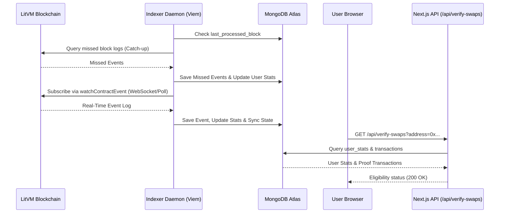

# Event Indexing Architecture: Viem WebSockets & MongoDB

This guide answers your architectural questions about building a real-time event-logging listener for quest-verification APIs (like `/api/verify-swaps` or `/api/stats`) and explains why a database is necessary and how to run it.

---

## 1. Do We Need a Database?

**Yes, absolutely.** If you want to log events in real-time, keep them for future reference, and run quest-verification APIs, you **cannot rely on in-memory storage or live on-chain RPC queries.** 

Here is why a database is required:

1. **State Persistence Across restarts:** If your Node.js server crashes, restarts (e.g., during deployments), or experiences network drops, any in-memory event cache is permanently lost.
2. **Reconnection & Catch-Up (Backfilling):** WebSockets are notoriously unstable over the public web; connections drop frequently due to rate limits, server load, or local network hiccups. When your listener reconnects, it must check the database to find the **last processed block**, then query historical blocks (via `getLogs`/`getContractEvents`) to backfill any missed events during the downtime.
3. **Query Performance & Aggregation:** For quest-like APIs (e.g., "Check if user X has swapped at least 10 times or traded > $100 volume"), aggregating data directly from raw RPC logs takes seconds and easily triggers RPC timeouts or rate-limiting. A database allows you to index transactions, keep pre-calculated user stats (like `totalVolumeUSD`), and serve query results in milliseconds.
4. **Decoupling Write & Read Paths:** Standard Next.js serverless functions (like Netlify functions) are stateless and short-lived. They cannot maintain a persistent WebSocket connection. You need a dedicated, long-running daemon process (the **Indexer**) to write to the DB, and simple API handlers to read from the DB.

---

## 2. Recommended System Architecture

Here is how the data flows through your system:



---

## 3. The Solution: `event-indexer.mjs`

We have created a production-ready indexer script: [event-indexer.mjs](file:///Users/jubayer/Desktop/Dex%20For%20LitVM/frontends/s2/flipswap/scripts/event-indexer.mjs).

This script performs the following tasks:
* Loads database credentials from your `.env.local` file.
* Connects to MongoDB Atlas using the `dex_tracker` database.
* Identifies the last synced block using a `sync_state` collection.
* Synchronizes historical blocks from the last processed block to the current block.
* Establishes a real-time subscription using `viem`'s `watchContractEvent`.
* Dynamically fetches ERC20 token metadata (decimals, symbol, name) from the blockchain on-demand and caches it in memory.
* Updates user statistics (`user_stats` collection) and saves individual swaps (`transactions` collection) with exact schema alignment to your Next.js application.

---

## 4. Running the Indexer in Production

To run this indexer in production, you should execute it as a persistent process (daemon) alongside your frontend application.

### Option A: Using PM2 (Recommended)
PM2 is a production process manager for Node.js applications that automatically restarts your script if it crashes.

1. **Install PM2 globally:**
   ```bash
   npm install -g pm2
   ```

2. **Start the indexer:**
   ```bash
   pm2 start scripts/event-indexer.mjs --name "dex-event-indexer"
   ```

3. **Check status & logs:**
   ```bash
   pm2 status
   pm2 logs dex-event-indexer
   ```

4. **Ensure PM2 starts on system boot:**
   ```bash
   pm2 startup
   pm2 save
   ```

### Option B: Docker Compose
If you deploy using Docker, you can run it as an additional service.
Add this to your `docker-compose.yml`:
```yaml
services:
  # ... existing services ...
  indexer:
    build: .
    command: node scripts/event-indexer.mjs
    environment:
      - MONGODB_URI=mongodb+srv://...
      - NEXT_PUBLIC_LITVM_RPC_URL=https://liteforge.rpc.caldera.xyz/infra-partner-http
      - LITVM_WS_RPC_URL=wss://liteforge.rpc.caldera.xyz/infra-partner-ws
    restart: always
```

---

## 5. WebSockets vs. HTTP Polling in Viem

In the script, we support both configurations:
* **WebSockets (`LITVM_WS_RPC_URL`):** Establishes a persistent full-duplex WebSocket connection. Recommended for low latency.
* **HTTP Polling (`NEXT_PUBLIC_LITVM_RPC_URL`):** If a WebSocket URL is not provided, `viem` automatically falls back to HTTP polling. This is highly resilient, works out-of-the-box with any standard RPC endpoint, and requires zero additional infrastructure.
